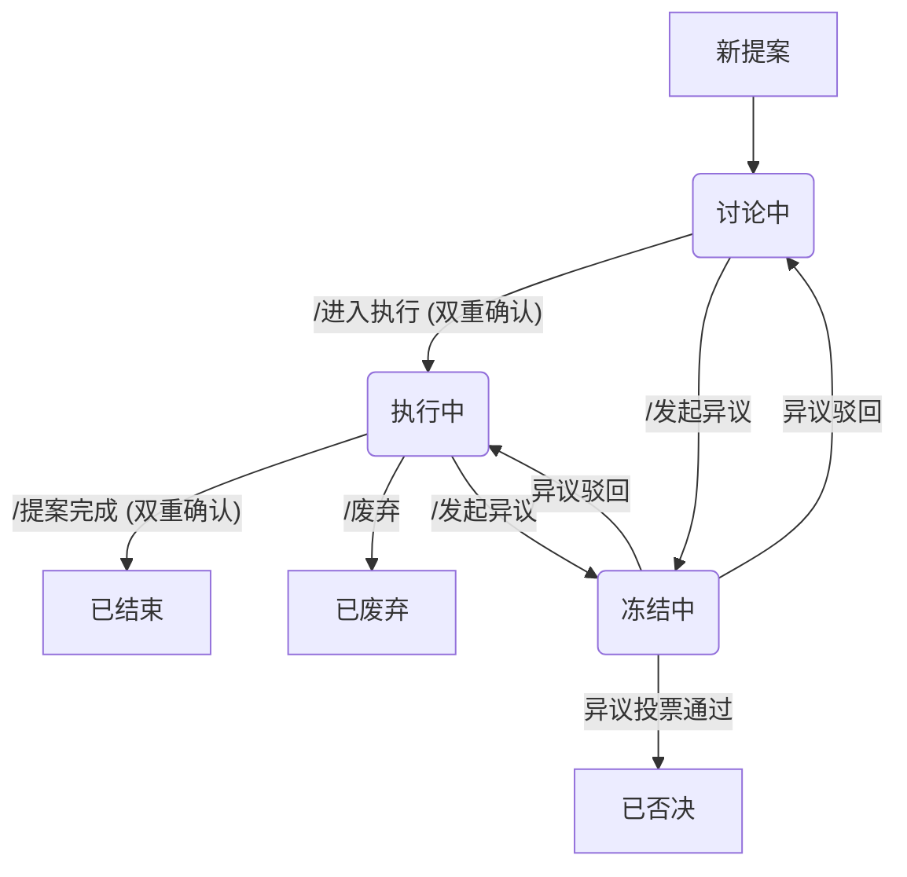

# StellariaPact

StellariaPact 是一个为社区治理设计的 Discord 机器人，旨在通过一系列结构化的指令和自动化流程，维护提案讨论、投票和执行的流程。

## 🚀 功能总览

StellariaPact 提供了从提案发起、讨论、执行到异议处理的全生命周期管理功能。其核心工作流如下：



### 角色与权限

机器人的操作权限与 Discord 角色绑定。各项关键操作需要特定角色才能执行：

- 管理组 (`stewards`): 拥有管理权限。
- 议事督导 (`councilModerator`): 负责监督提案讨论和流程。
- 执行监理 (`executionAuditor`): 负责监督提案的执行过程。

权限配置位于 `config.json` 文件中

### 提案状态

每个提案都有一个明确的状态标签，以追踪其在生命周期中的位置：

- 讨论中: 提案的初始状态，社区成员可在此阶段自由讨论。
- 执行中: 提案已获得批准，进入方案落地阶段。
- 冻结中: 提案因收到有效异议而被暂停，等待异议处理结果。
- 已结束: 提案流程正常完成。
- 已废弃: 提案在执行过程中因故被中止。
- 已否决: 提案在讨论或异议阶段被投票驳回。

## 指令手册

### 提案生命周期 (Lifecycle)

#### `/进入执行`
- 功能: 将一个处于 `[讨论中]` 状态的提案推进到 `[执行中]` 状态。
- 权限: `议事督导` + `执行监理`
- 流程:
    1. 指令发起者在提案帖中使用此命令。
    2. Bot 发出一个确认面板，需要另一角色的成员点击确认。
    3. 获得双方确认后，提案状态变更为 `[执行中]`，并发出公示。

#### `/提案完成`
- 功能: 将一个处于 `[执行中]` 状态的提案推进到 `[已结束]` 状态。
- 权限: `议事督导` + `执行监理`
- 流程:
    1. 指令发起者在提案帖中使用此命令。
    2. Bot 发出一个确认面板，需要另一角色的成员点击确认。
    3. 获得双方确认后，提案状态变更为 `[已结束]` (关闭并归档)，并发出公示。

#### `/废弃`
- 功能: 中止一个正在 `[执行中]` 的提案。
- 权限: `执行监理`
- 流程:
    1. `执行监理` 在提案帖中使用此命令。
    2. Bot 将提案状态更新为 `[已废弃]`(关闭并归档)，并发出公示。

### 异议处理 (Objection)

#### `/发起异议`
- 功能: 对一个正在进行中的提案发起异议。
- 权限: 所有社区成员
- 流程:
    1. 用户在任意频道使用此命令，并通过弹窗填写异议理由和目标提案链接。
    2. 系统记录异议，并根据是否为首次异议决定所需的支持票数（首次为5票，后续为10票）。
    3. 在指定频道创建异议收集面板，供社区成员投票支持。
    4. 当支持票数达到要求后，原提案被标记为 `[冻结中]` (关闭并归档)。
    5. 异议本身会进入正式投票，根据投票结果决定是推翻原提案还是驳回异议。

### 投票 (Voting)
- 功能: 为帖子提供通用的投票服务。
- 核心逻辑:
    1. Bot 会自动在提案频道的新帖子下创建投票面板并对其进行索引。(索引后，允许通过指令修改其生命周期)
    2. 点击投票按钮，用户会看到一个私密的投票界面，其中显示自己的投票资格。投票界面优先通过私信发送(15分钟后关闭)，如无法发送，则会在帖子底部发送一条私密消息s
    3. 投票资格: 默认要求用户在当前帖子内有至少3条有效发言（长度超过5个字符且非纯表情）。
    4. `提案人`/`议事督导`/`执行监理` 可以调整投票持续时间（默认2天）、是否匿名（默认匿名）、是否实时展示投票数(默认实时)。
    5. 投票到期后，Bot 会自动公布结果。并 @ `议事督导`/`执行监理`身份组
    6. `提案人`/`议事督导`/`执行监理` 可以在投票到期后点击投票按钮，选择重新开启投票

#### `/创建提案投票`
- 功能: 为一个提案贴创建一个新的投票面板，并进行索引(一个提案贴允许有多个投票面板)
- 权限: `提案人`/`议事督导`/`执行监理`
- 流程:
    1. 指令发起者在提案帖中使用此命令。
    2. Bot 在提案帖中创建一个新的投票面板

### 管理 (Moderation)

#### `/踢出提案` (右键菜单指令)
- 功能: 剥夺某个用户在特定提案中的投票资格。
- 权限: `议事督导`
- 流程:
    1. `议事督导` 在提案帖中右键点击目标用户的消息，选择此应用指令。
    2. 在弹窗中填写理由。
    3. Bot 会将该用户在该提案的投票资格标记为无效，并发出公示。

### 通知 (Notification)

#### `/发布公示`
- 功能: 向社区发布一个官方公示。
- 权限: `管理组`/`议事督导`/`执行监理`
- 流程:
    1. 管理员使用此命令，设定公示内容、持续时间、公示重放时间间隔、消息间隔、是否在公示结束后直接进入执行(仅`管理组`可设置为`是`)
    2. 若未填入讨论帖链接，则 Bot 会在议事频道创建一个新的讨论帖。若已填入讨论帖链接，则公示会直接使用现有讨论帖链接
    3. Bot 转发公告到所有指定的宣传频道
    4. 公示期间，若某个宣传频道同时满足时间和消息数门槛，则会在该频道重新播放一次公示
    5. 公示期结束后，@ `管理组`，并根据设置选择是否自动进入 `[执行中]` 状态

---

## ⚡ 快速开始 (windows 部署)

要求: [Python 3.8+](https://www.python.org/downloads/)

1.  下载项目代码
    ```bash
    git clone https://github.com/warming-afternoon/StellariaPact.git
    cd StellariaPact
    ```

2.  准备配置文件
    -   将 `.env.example` 复制为 `.env`，并填入你的 `DISCORD_TOKEN`。
        ```bash
        cp .env.example .env
        ```
    -   将 `config.json.example` 复制为 `config.json`，并根据你的服务器需求配置角色 ID 等信息。
        ```bash
        cp config.json.example config.json
        ```

3.  运行安装脚本
    这将是您需要运行的唯一的安装命令。它会自动安装所有需要的工具和依赖。

    *   作为普通用户:
        ```bash
        python setup.py
        ```
    *   作为开发者:
        ```bash
        python setup.py dev
        ```

4.  日常运行
    安装完成后，你可以随时使用以下命令来启动机器人：
    ```bash
    uv run stellaria-pact
    ```

---

## 🐳 使用 Docker 部署 (linux 部署)

### 要求
- [Docker](https://docs.docker.com/get-docker/)

### 部署步骤

1.  准备配置文件
    -   将 `.env.example` 复制为 `.env`，并填入你的 `DISCORD_TOKEN`。
        ```bash
        cp .env.example .env
        ```
    -   将 `config.json.example` 复制为 `config.json`，并根据你的服务器需求配置角色 ID 等信息。
        ```bash
        cp config.json.example config.json
        ```

2.  构建并启动容器 (日常运行)
    使用 `docker compose` 在后台构建并启动容器：
    ```bash
    docker compose up --build -d
    ```

3.  查看日志
    你可以使用以下命令来实时查看机器人的日志：
    ```bash
    docker compose logs -f
    ```

4.  停止容器
    如果需要停止机器人，运行：
    ```bash
    docker compose down
    ```
## ‍💻 开发指南 (For Developers)

`python setup.py dev` 命令会自动为你安装所有开发工具（如 `ruff`, `pre-commit`）并设置好 Git 钩子。

### 日常开发命令

所有命令都通过 `uv run` 执行，无需手动激活虚拟环境

*   运行机器人:
    ```bash
    uv run stellaria-pact
    ```

*   代码格式化:
    ```bash
    uv run ruff format .
    ```

*   代码检查:
    ```bash
    uv run ruff check .
    ```

### 依赖管理

*   添加新依赖:
    1.  手动将包名添加到 `pyproject.toml` 的 `dependencies` 或 `dev` 列表中。
    2.  运行 `uv pip install -e .[dev]` 或 `uv pip install .` 来更新环境。

*   更新锁文件:
    当你手动修改 `pyproject.toml` 后，运行以下命令来更新 `uv.lock` 文件，以保证所有协作者的环境一致性：
    ```bash
    uv pip compile pyproject.toml -o uv.lock