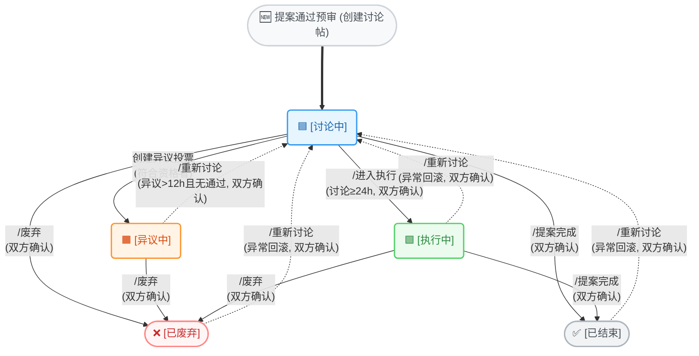

# StellariaPact

StellariaPact 是一个为社区治理设计的 Discord 机器人，旨在通过一系列结构化的指令和自动化流程，维护提案讨论、投票和执行的流程。

## 🚀 功能总览

StellariaPact 提供了从提案发起、讨论、执行到异议处理的全生命周期管理功能。

### 角色与权限

机器人的操作权限与 Discord 角色绑定。各项关键操作需要特定角色才能执行：

- 管理组 (`stewards`): 拥有管理权限。
- 议事督导 (`councilModerator`): 负责监督提案讨论和流程。
- 执行监理 (`executionAuditor`): 负责监督提案的执行过程。

权限配置位于 `config.json` 文件中

### 提案状态

每个提案都有一个明确的状态标签，以追踪其在生命周期中的位置：

- 讨论中: 提案的初始状态，社区成员可在此阶段自由讨论。
- 异议中: 提案存在异议投票，正在进行异议讨论
- 执行中: 提案已获得批准，进入方案落地阶段。
- 已结束: 提案流程正常完成。
- 已废弃: 提案因故被废弃。

## 指令手册

### 投票 (Voting)

Bot 会自动创建投票面板。

#### `投票管理`

点击投票面板下方 "投票管理"按钮，用户会看到一个私密的投票界面，其中包括 "普通投票" 及 "异议投票(若存在)"。
投票界面优先通过私信发送 (15分钟后关闭)，如无法发送，则会在帖子底部发送一条私密消息

投票资格: 要求用户在当前帖子内有至少2条有效发言（长度超过5个字符且非纯表情）。

投票到期后，Bot 会自动公布结果。并 @ `议事督导`/`执行监理`身份组

#### `规则管理`

`提案人`/`议事督导`/`执行监理`/`管理组` 点击 "规则管理" 按钮时，会弹出管理面板

在管理面板中，能调整投票持续时间（默认 3 天）、是否匿名（默认匿名）、是否实时展示投票数(默认实时)、投票结束是否通知提案委员(默认通知)。
在投票结束时，能重新开启投票。

#### `创建普通投票`

`提案人`/`议事督导`/`执行监理`/`管理组`/`在当前帖子中的有效发言数 > 10 的用户` , 点击 "创建普通投票" ，并在弹出的输入框中输入投票内容后，可以创建一个普通投票

#### `创建异议投票`

当提案处于 `[讨论中]` 状态时， `提案人`/`议事督导`/`执行监理`/`管理组`/`在当前帖子的有效发言数 > 10 的用户` , 点击 "创建普通投票" ，并在弹出的输入框中输入投票内容后，可以创建一个异议投票

然后，提案会进入 `[异议中]` 状态

### 提案生命周期 (Moderation)

核心工作流如下：


```mermaid
graph TD
    %% 设置平滑曲线
    %%{init: {"flowchart": {"curve": "basis"}}}%%

    %% 定义节点 (精简了节点形状，避免巨大圆形)
    Start(["🆕 提案通过预审 (创建讨论帖)"])
    
    Discuss("🟦 [讨论中]")
    Objection("🟧 [异议中]")
    Execute("🟩 [执行中]")
    Ended(["✅ [已结束]"])
    Abandoned(["❌ [已废弃]"])

    %% 初始流程
    Start ===> Discuss

    %% [讨论中] 的核心推进流程 (使用双引号包裹以解决语法报错)
    Discuss -->|"创建异议投票<br/>(符合资格者)"| Objection
    Discuss -->|"/进入执行<br/>(讨论≥24h, 双方确认)"| Execute
    
    %% 正常结束流程
    Discuss -->|"/提案完成<br/>(双方确认)"| Ended
    Execute -->|"/提案完成<br/>(双方确认)"| Ended

    %% 废弃流程
    Discuss -->|"/废弃<br/>(双方确认)"| Abandoned
    Objection -->|"/废弃<br/>(双方确认)"| Abandoned
    Execute -->|"/废弃<br/>(双方确认)"| Abandoned

    %% 回滚流程 (虚线)
    Objection -.->|"/重新讨论<br/>(异议>12h且无通过, 双方确认)"| Discuss
    Execute -.->|"/重新讨论<br/>(异常回滚, 双方确认)"| Discuss
    Ended -.->|"/重新讨论<br/>(异常回滚, 双方确认)"| Discuss
    Abandoned -.->|"/重新讨论<br/>(异常回滚, 双方确认)"| Discuss

    %% 节点颜色与样式
    classDef state_start fill:#f8f9fa,stroke:#ced4da,stroke-width:2px,color:#495057;
    classDef state_discuss fill:#e7f5ff,stroke:#339af0,stroke-width:2px,color:#1864ab;
    classDef state_objection fill:#fff4e6,stroke:#ff922b,stroke-width:2px,color:#d9480f;
    classDef state_execute fill:#ebfbee,stroke:#51cf66,stroke-width:2px,color:#2b8a3e;
    classDef state_end fill:#f1f3f5,stroke:#adb5bd,stroke-width:2px,color:#495057;
    classDef state_abandon fill:#fff5f5,stroke:#ff8787,stroke-width:2px,color:#c92a2a;

    class Start state_start;
    class Discuss state_discuss;
    class Objection state_objection;
    class Execute state_execute;
    class Ended state_end;
    class Abandoned state_abandon;
```

#### `/重新讨论`
- 功能: 将一个任何状态的提案回退到 `[讨论中]` 状态。
- 权限: `议事督导` + `执行监理`
- 流程:
    1. 指令发起者在提案帖中使用此命令。
    2. 若提案存在异议投票，则需所有异议投票创建时间超过 12h，且不存在任何一条支持居多的异议，才能重新讨论。否则终止流程
    3. Bot 发出一个确认面板，需要另一角色的成员点击确认。
    4. 获得双方确认后，提案状态变更为 `[讨论中]`，并发出公示。

#### `/进入执行`
- 功能: 将一个处于 `[讨论中]` 状态的提案推进到 `[执行中]` 状态。
- 权限: `议事督导` + `执行监理`
- 流程:
    1. 指令发起者在提案帖中使用此命令。
    2. 若提案已讨论 24 小时及以上，则继续处理。否则终止流程
    3. Bot 发出一个确认面板，需要另一角色的成员点击确认。
    4. 获得双方确认后，提案状态变更为 `[执行中]`，并发出公示。

#### `/提案完成`
- 功能: 将一个处于 `[讨论中]` 或 `[执行中]` 状态的提案推进到 `[已结束]` 状态。
- 权限: `议事督导` + `执行监理`
- 流程: (同 `/进入执行` )

#### `/废弃`
- 功能: 中止一个处于 `[讨论中/执行中/异议中]` 状态的提案，使其状态转为 `[已废弃]`。
- 权限: `议事督导` + `执行监理`
- 流程: (同 `/进入执行` )

### 提案内容变更 (ThreadManage)

#### `/修改提案内容`
- 功能: 对于已经通过审核，进入讨论流程的提案进行内容变更
- 权限: `管理组` 

### 处罚管理 (Punishment)

#### `/踢出提案` (右键菜单指令)
- 功能: 剥夺某个用户在特定提案中的投票资格/发言资格。
- 权限: `议事督导`
- 流程:
    1. `议事督导` 在提案帖中右键点击目标用户的消息，选择此应用指令。
    2. 在弹窗中填写理由。
    3. Bot 会进行相应处理，并发出公示。

注: 对同一人在同一帖中使用多次 `/踢出提案` 时，后面的处罚会覆盖前面的处罚
可以使用这个来进行处罚管理

### 提案提交及审核 (Intake)

#### `/设置提交入口`
- 功能: 创建提案提交入口
- 权限: `管理组`

#### `提案处理`
- 流程:
	1. 提案人在 提案提交入口处 提交新提案
	2. 提案在 提案预审核区 创建审核帖
	3. 提案人可以在管理员 审批通过/拒绝前 修改提案内容
	4. 管理员可以进行 审批通过/拒绝/要求修改 处理
	5. 提案 审批通过 后，将在 提案审核公示区 创建投票收集面板。在 3 天内收集满 20 张收藏票，则创建提案讨论帖

### 通知 (Notification)

#### `/发布公示`
- 功能: 向社区发布一个官方公示。( 4-168 小时)
- 权限: `管理组`/`议事督导`/`执行监理`
- 流程:
    1. 用户使用此命令，设定公示内容、持续时间、公示重放时间间隔、消息间隔、是否在公示结束后直接进入执行(仅`管理组`可设置为`是`)
    2. 若未填入讨论帖链接，则 Bot 会在议事频道创建一个新的讨论帖。若已填入讨论帖链接，则公示会直接使用现有讨论帖链接
    3. Bot 转发公告到所有指定的宣传频道
    4. 公示期间，若某个宣传频道同时满足时间和消息数门槛，则会在该频道重新播放一次公示
    5. 公示期结束后，@ `管理组`，并根据设置选择是否自动进入 `[执行中]` 状态


#### `/修改公示时间`
- 功能: 修改公示时间
- 权限: `管理组`/`议事督导`/`执行监理`

---

## ⚡ 快速开始 (windows 部署)

要求: [Python 3.8+](https://www.python.org/downloads/)

1.  下载项目代码
    ```bash
    git clone https://github.com/warming-afternoon/StellariaPact.git
    cd StellariaPact
    ```

2.  准备配置文件
    -   将 `.env.example` 复制为 `.env`，并填入你的 `DISCORD_TOKEN`。
        ```bash
        cp .env.example .env
        ```
    -   将 `config.json.example` 复制为 `config.json`，并根据你的服务器需求配置角色 ID 等信息。
        ```bash
        cp config.json.example config.json
        ```

3.  运行安装脚本
    这将是您需要运行的唯一的安装命令。它会自动安装所有需要的工具和依赖。

    *   作为普通用户:
        ```bash
        python setup.py
        ```
    *   作为开发者:
        ```bash
        python setup.py dev
        ```

4.  日常运行
    安装完成后，你可以随时使用以下命令来启动机器人：
    ```bash
    uv run stellaria-pact
    ```

---

## 🐳 使用 Docker 部署 (linux 部署)

### 要求
- [Docker](https://docs.docker.com/get-docker/)

### 部署步骤

1.  准备配置文件
    -   将 `.env.example` 复制为 `.env`，并填入你的 `DISCORD_TOKEN`。
        ```bash
        cp .env.example .env
        ```
    -   将 `config.json.example` 复制为 `config.json`，并根据你的服务器需求配置角色 ID 等信息。
        ```bash
        cp config.json.example config.json
        ```

2.  构建并启动容器 (日常运行)
    使用 `docker compose` 在后台构建并启动容器：
    ```bash
    docker compose up --build -d
    ```

3.  查看日志
    你可以使用以下命令来实时查看机器人的日志：
    ```bash
    docker compose logs -f
    ```

4.  停止容器
    如果需要停止机器人，运行：
    ```bash
    docker compose down
    ```
## ‍💻 开发指南 (For Developers)

`python setup.py dev` 命令会自动为你安装所有开发工具（如 `ruff`, `pre-commit`）并设置好 Git 钩子。

### 日常开发命令

所有命令都通过 `uv run` 执行，无需手动激活虚拟环境

*   运行机器人:
    ```bash
    uv run stellaria-pact
    ```

*   代码格式化:
    ```bash
    uv run ruff format .
    ```

*   代码检查:
    ```bash
    uv run ruff check .
    ```

### 依赖管理

*   添加新依赖:
    1.  手动将包名添加到 `pyproject.toml` 的 `dependencies` 或 `dev` 列表中。
    2.  运行 `uv pip install -e .[dev]` 或 `uv pip install .` 来更新环境。

*   更新锁文件:
    当你手动修改 `pyproject.toml` 后，运行以下命令来更新 `uv.lock` 文件，以保证所有协作者的环境一致性：
    ```bash
    uv pip compile pyproject.toml -o uv.lock
    ```
